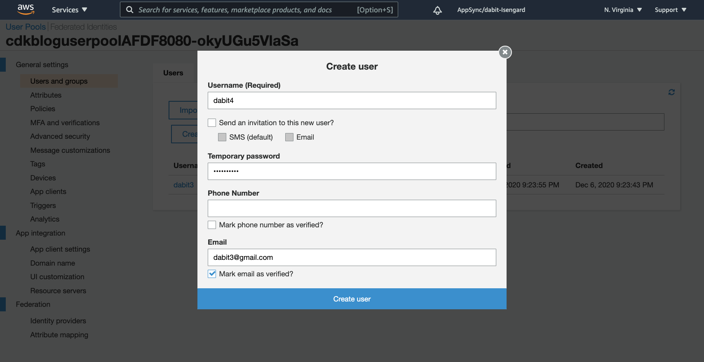
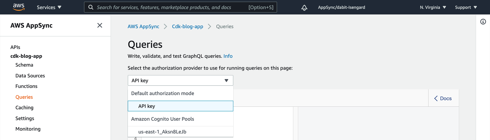
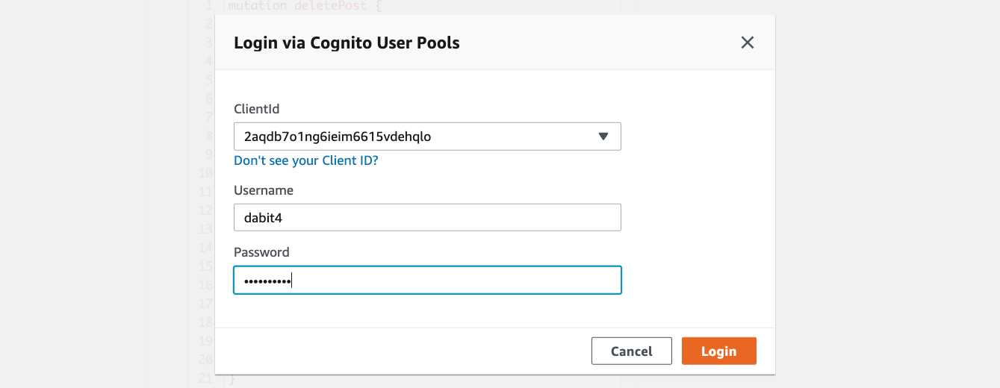

# CDK with Next.js and AWS Amplify Workshop


In this workshop we'll build a full stack cloud application with [Next.js](https://nextjs.org/), [AWS CDK](https://aws.amazon.com/cdk/), [AWS AppSync](https://aws.amazon.com/appsync/), & [AWS Amplify](https://docs.amplify.aws/).

### Overview

We'll start from scratch, creating a new Next.js app. We'll then, step by step, use CDK to build out and configure our cloud infrastructure and then use the [Amplify JS Libraries](https://github.com/aws-amplify/amplify-js) to connect the Next.js app to the APIs we create using CDK.

The app will be a multi-user blogging app with a markdown editor.

When you think of many types of applications like Instagram, Twitter, or Facebook, they consist of a list of items and often the ability to drill down into a single item view. The app we will be building will be very similar to this, displaying a list of posts with data like the title, content, and author of the post.

We'll then add user authentication and authorization, enabling signed in users to edit and delete their own posts.

This workshop should take you anywhere between 4 to 6 hours to complete.

### Environment & prerequisites

Before we begin, make sure you have the following:

- Node.js v10.3.0 or later  installed
- A valid and confirmed AWS account
- You must provide IAM credentials and an AWS Region to use AWS CDK, if you have not already done so. If you have the AWS CLI installed, the easiest way to satisfy this requirement is to [install the AWS CLI](https://docs.aws.amazon.com/cli/latest/userguide/install-cliv2.html) and issue the following command:

```sh
aws configure
```

> When configuring the IAM user, be sure to give them Administrator Access Privileges


We will be working from a terminal using a [Bash shell](https://en.wikipedia.org/wiki/Bash_(Unix_shell)) to run CDK CLI commands to provision infrastructure and also to run a local version of the Next.js app and test it in a web browser.

> To view the CDK pre-requisite docs, click [here](https://docs.aws.amazon.com/cdk/latest/guide/getting_started.html)

### Background needed / level

This workshop is intended for intermediate to advanced JavaScript developers wanting to learn more about full stack serverless development.

While some level of React and GraphQL is helpful, because all front end code provided is copy and paste-able, this workshop requires zero previous knowledge about React or GraphQL.

### Topics we'll be covering:

- GraphQL API with AWS AppSync
- Authentication
- Authorization
- Hosting
- Deleting the resources

## Getting Started

To get started, we first need to create a base folder for the app. Create a folder called __cdk-next__ and change into it.

Next, create the Next.js app inside the __cdk-next__ directory:

```bash
$ npx create-next-app next-frontend
```

Now change into the new app directory & install these dependencies using either `npm` or `yarn`:

```bash
$ cd next-frontend
$ npm install aws-amplify @aws-amplify/ui-react react-simplemde-editor react-markdown uuid
```

Next, change back into the root directory to begin building the back end infrastructure.

## Installing the CLI & Initializing a new CDK Project

### Installing the CDK CLI

Next, we'll install the CDK CLI:

```bash
$ npm install -g aws-cdk
```

### Initializing A New Project

```bash
$ mkdir next-backend
$ cd next-backend
$ cdk init --language=typescript
```

The CDK CLI has initialized a new project. 

To build the project at any time, you can run the `build` command:

```sh
$ npm run build
```

#### Bootstrapping

When you run `cdk bootstrap`, cdk deploys the CDK toolkit stack into an AWS environment. The `cdk bootstrap` command is run one time per account / region.

If this is your first time using CDK, run the following command:

```sh
$ cdk bootstrap

# or

$ cdk bootstrap --profile <preferred-aws-profile>
```

#### View changes

To view the resources to be deployed or changes in infrastructure at any time, you can run the CDK `diff` command:

```sh
$ cdk diff
```

Next, install the CDK dependencies we'll be using using either `npm` or `yarn`:

```sh
$ npm install @aws-cdk/aws-cognito @aws-cdk/aws-appsync @aws-cdk/aws-lambda @aws-cdk/aws-dynamodb
```

## Creating the authentication service with CDK

When working with CDK, the code for the main stack lives in the __lib__ directory. When we created the project, the CLI created a file named __next-backend-stack.ts__ where our stack code is written.

Open the file and let's first import the constructs and classes we'll need for our project:

```typescript
// lib/next-backend-stack.ts
import * as cdk from '@aws-cdk/core'
import * as cognito from '@aws-cdk/aws-cognito'
import * as appsync from '@aws-cdk/aws-appsync'
import * as ddb from '@aws-cdk/aws-dynamodb'
import * as lambda from '@aws-cdk/aws-lambda'
```

Next, update the class with the following code to create the Amazon Cognito authentication service:

```typescript
// lib/next-backend-stack.ts
export class NextBackendStack extends cdk.Stack {
  constructor(scope: cdk.Construct, id: string, props?: cdk.StackProps) {
    super(scope, id, props)

    const userPool = new cognito.UserPool(this, 'cdk-blog-user-pool', {
      selfSignUpEnabled: true,
      accountRecovery: cognito.AccountRecovery.PHONE_AND_EMAIL,
      userVerification: {
        emailStyle: cognito.VerificationEmailStyle.CODE
      },
      autoVerify: {
        email: true
      },
      standardAttributes: {
        email: {
          required: true,
          mutable: true
        }
      }
    })

    const userPoolClient = new cognito.UserPoolClient(this, "UserPoolClient", {
      userPool
    })
  }
}
```

This code will create a Cognito User Pool that will enable the user to sign in with a username, email address, and password.

A `userPoolClient` will also be created enabling client applications, in our case the Next.js app, to interact with the service.

## Adding the AWS AppSync GraphQL API with CDK

Next, we'll need to create the AppSync GraphQL API.

To create the API, add the following code below the User Pool definition in __lib/next-backend-stack.ts__.

```typescript
// lib/next-backend-stack.ts
const api = new appsync.GraphqlApi(this, 'cdk-blog-app', {
  name: "cdk-blog-app",
  logConfig: {
    fieldLogLevel: appsync.FieldLogLevel.ALL,
  },
  schema: appsync.Schema.fromAsset('./graphql/schema.graphql'),
  authorizationConfig: {
    defaultAuthorization: {
      authorizationType: appsync.AuthorizationType.API_KEY,
      apiKeyConfig: {
        expires: cdk.Expiration.after(cdk.Duration.days(365))
      }
    },
    additionalAuthorizationModes: [{
      authorizationType: appsync.AuthorizationType.USER_POOL,
      userPoolConfig: {
        userPool,
      }
    }]
  },
})
```

This code will create an AppSync GraphQL API with two types of authentication: API Key (public access) and Amazon Cognito User Pool (private, authenticated access).

Our app will be using a combination of public and private access to achieve a common real world use case that combines the two types of access.

For example, we want developers to be able to read blog posts whether they are signed in or not, but if a user is signed in, we want to give them the correct access so that they can update or delete posts that they have created (but only their own posts).

## Adding the GraphQL schema

In the code where we defined the GraphQL API, we set the GraphQL schema directory as __./graphql/schema.graphql__, but we have not yet created the schema, so let's do that now.

In the root of the CDK project, create a folder called __graphql__ and a file in that folder named __schema.graphql__. In that file, add the following code:

```graphql
# graphql/schema.graphql
type Post @aws_api_key @aws_cognito_user_pools {
  id: ID!
  title: String!
  content: String!
  owner: String!
}

input PostInput {
  id: ID
  title: String!
  content: String!
}

input UpdatePostInput {
  id: ID!
  title: String
  content: String
}

type Query {
  getPostById(postId: ID!): Post
    @aws_api_key @aws_cognito_user_pools
  listPosts: [Post]!
    @aws_api_key @aws_cognito_user_pools
  postsByUsername: [Post]!
    @aws_cognito_user_pools
}

type Mutation {
  createPost(post: PostInput!): Post!
    @aws_cognito_user_pools
  deletePost(postId: ID!): ID
    @aws_cognito_user_pools
  updatePost(post: UpdatePostInput!): Post
    @aws_cognito_user_pools
}

type Subscription {
  onCreatePost: Post!
    @aws_subscribe(mutations: ["createPost"])
}
```

This schema defines the `Post` type that we'll be needing along with all of the input types and operations for creating, updating, and reading `Post`s.

There are also authorization rules set in place by using `@aws_api_key` and `@aws_cognito_user_pools`.

__@aws_api_key__ enables public access.

__@aws_cognito_user_pools__ configures private access for signed in users.

You will notice that some of the queries enable both public and private access, while the mutations only allow private access. That is because we only want to enable signed in users to be able to update `Post`s, and we will even be implementing businness logic that only allows users to update `Post`s if they are the owner / creator of the `Post`.

## Adding and configuring a Lambda function data source

Next, we'll create a Lambda function. The Lambda function will be the main datasource for the API, meaning we will map all of the GraphQL operations (mutations and subscriptions) into the function.

The function will then call the DynamoDB database to execute of the operations we will be needing for creating, reading, updating, and deleting items in the database.

To create the Lambda function, add the following code below the API definition in __lib/next-backend-stack.ts__.

```typescript
// lib/next-backend-stack.ts

// Create the function
const postLambda = new lambda.Function(this, 'AppSyncPostHandler', {
  runtime: lambda.Runtime.NODEJS_14_X,
  handler: 'main.handler',
  code: lambda.Code.fromAsset('lambda-fns'),
  memorySize: 1024
})

// Set the new Lambda function as a data source for the AppSync API
const lambdaDs = api.addLambdaDataSource('lambdaDatasource', postLambda)
```

## Adding the GraphQL resolvers

Now we will create the GraphQL resolver definitions that will map the requests coming into the API into the Lambda function.

To create the resolvers, add the following code below the Lambda function definition in __lib/next-backend-stack.ts__.

```typescript
// lib/next-backend-stack.ts
lambdaDs.createResolver({
  typeName: "Query",
  fieldName: "getPostById"
})

lambdaDs.createResolver({
  typeName: "Query",
  fieldName: "listPosts"
})

lambdaDs.createResolver({
  typeName: "Query",
  fieldName: "postsByUsername"
})

lambdaDs.createResolver({
  typeName: "Mutation",
  fieldName: "createPost"
})

lambdaDs.createResolver({
  typeName: "Mutation",
  fieldName: "deletePost"
})

lambdaDs.createResolver({
  typeName: "Mutation",
  fieldName: "updatePost"
})
```

## Creating the database

Next, we'll create the DynamoDB table that our API will be using to store data.

To create the database, add the following code below the GraphQL resolver definitions in __lib/next-backend-stack.ts__.

```typescript
// lib/next-backend-stack.ts

// Create the DynamoDB table
const postTable = new ddb.Table(this, 'CDKPostTable', {
  billingMode: ddb.BillingMode.PAY_PER_REQUEST,
  partitionKey: {
    name: 'id',
    type: ddb.AttributeType.STRING,
  },
})

// Add a global secondary index to enable another data access pattern
postTable.addGlobalSecondaryIndex({
  indexName: "postsByUsername",
  partitionKey: {
    name: "owner",
    type: ddb.AttributeType.STRING,
  }
})

// Enable the Lambda function to access the DynamoDB table (using IAM)
postTable.grantFullAccess(postLambda)

// Create an environment variable that we will use in the function code
postLambda.addEnvironment('POST_TABLE', postTable.tableName)
```

This code will create a DynamoDB table and add a Global Secondary Index to enable us the query the table by the `username` field.

We also enable permissions for the Lambda function we created earlier to be able to interact with the table as well as a new environment variable that we will be using to reference the table from within the function.

## Printing out resource values for client-side configuration

If we’d like to consume the API from a client application (like we will be doing in our Next.js app), we’ll need the values of the API key, GraphQL URL, Cognito User Pool ID, Cognito User Pool Client ID, and project region to configure our app.

We _could_ go inside the AWS console for each service and find these values, but CDK enables us to print these out to our terminal upon deployment as well as map these values to an output file that we can later import in our web or mobile application and use with AWS Amplify.

To create these output values, add the following code below the DynamoDB table definition in __lib/next-backend-stack.ts__.

```typescript
// lib/next-backend-stack.ts
new cdk.CfnOutput(this, "GraphQLAPIURL", {
  value: api.graphqlUrl
})

new cdk.CfnOutput(this, 'AppSyncAPIKey', {
  value: api.apiKey || ''
})

new cdk.CfnOutput(this, 'ProjectRegion', {
  value: this.region
})

new cdk.CfnOutput(this, "UserPoolId", {
  value: userPool.userPoolId
})

new cdk.CfnOutput(this, "UserPoolClientId", {
  value: userPoolClient.userPoolClientId
})
```

## Adding the Lambda function code

The last thing we need to do is write the code for the Lambda function. The Lambda function will map the GraphQL operations coming in via the event into a call to the DynamoDB database. We will have functions for all of the operations defined in the GraphQL schema. The Lambda handler will read the GraphQL operation from the `event` object and call the appropriate function.

Create a folder named __lambda-fns__ in the root directory of the CDK project. Next, change into this directory and initialize a new __package.json__ file and install the `uuid` library:

```sh
cd lambda-fns
npm init --y
npm install uuid && npm install -D @types/uuid
```

In the __lambda-fns__ folder, create the following files:

- Post.ts
- main.ts
- createPost.ts
- listPosts.ts
- getPostById.ts
- deletePost.ts
- updatePost.ts
- postsByUsername.ts

### Post.ts

```typescript
// lambda-fns/Post.ts
type Post = {
  id: string,
  title: string,
  content: string,
  owner: string
}

export default Post
```

The Post type should match the GraphQL Post type and will be used in a couple of our files.

### main.ts

```typescript
// lambda-fns/main.ts
import createPost from './createPost'
import deletePost from './deletePost'
import getPostById from './getPostById'
import listPosts from './listPosts'
import updatePost from './updatePost'
import postsByUsername from './postsByUsername'
import Post from './Post'

type AppSyncEvent = {
   info: {
     fieldName: string
  },
   arguments: {
     postId: string,
     post: Post
  },
  identity: {
    username: string
  }
}

exports.handler = async (event:AppSyncEvent) => {
    switch (event.info.fieldName) {
        case "getPostById":
          return await getPostById(event.arguments.postId)
        case "createPost": {
          const { username } = event.identity
          return await createPost(event.arguments.post, username)
        }
        case "listPosts":
          return await listPosts()
        case "deletePost": {
          const { username } = event.identity
          return await deletePost(event.arguments.postId, username)
        }
        case "updatePost": {
          const { username } = event.identity
          return await updatePost(event.arguments.post, username)
        }
        case "postsByUsername": {
          const { username } = event.identity
          return await postsByUsername(username)
        }
        default:
          return null
    }
}
```

The handler function will use the GraphQL operation available in the `event.info.fieldname` to call the various functions that will interact with the DynamoDB database.

The function will also be passed an `identity` object if the request has been authenticated by AppSync. If the event is coming from an authenticated request, then the `identity` object will be null.

### createPost.ts

```typescript
// lambda-fns/createPost.ts
const AWS = require('aws-sdk')
const docClient = new AWS.DynamoDB.DocumentClient()
import Post from './Post'
import { v4 as uuid } from 'uuid'

async function createPost(post: Post, username: string) {
  if (!post.id) {
    post.id = uuid()
  }
  const postData = { ...post, owner: username }
  const params = {
    TableName: process.env.POST_TABLE,
    Item: postData
  }
  try {
    await docClient.put(params).promise()
    return postData
  } catch (err) {
    console.log('DynamoDB error: ', err)
    return null
  }
}

export default createPost
```

### listPosts.ts

```typescript
// lambda-fns/listPosts.ts
const AWS = require('aws-sdk')
const docClient = new AWS.DynamoDB.DocumentClient()

async function listPosts() {
    const params = {
        TableName: process.env.POST_TABLE,
    }
    try {
        const data = await docClient.scan(params).promise()
        return data.Items
    } catch (err) {
        console.log('DynamoDB error: ', err)
        return null
    }
}

export default listPosts
```

The `listPosts` function scans the database and returns all of the results in an array.

### getPostById.ts

```typescript
// lambda-fns/getPostById.ts
const AWS = require('aws-sdk')
const docClient = new AWS.DynamoDB.DocumentClient()

async function getPostById(postId: string) {
    const params = {
        TableName: process.env.POST_TABLE,
        Key: { id: postId }
    }
    try {
        const { Item } = await docClient.get(params).promise()
        return Item
    } catch (err) {
        console.log('DynamoDB error: ', err)
    }
}

export default getPostById
```

### deletePost.ts

```typescript
// lambda-fns/deletePost.ts
const AWS = require('aws-sdk')
const docClient = new AWS.DynamoDB.DocumentClient()

async function deletePost(postId: string, username: string) {
  const params = {
    TableName: process.env.POST_TABLE,
    Key: {
      id: postId
    },
    ConditionExpression: "#owner = :owner",
    ExpressionAttributeNames: {
      "#owner": "owner"
    },
    ExpressionAttributeValues: {
      ':owner' : username
    }
}
  try {
    await docClient.delete(params).promise()
    return postId
  } catch (err) {
    console.log('DynamoDB error: ', err)
    return null
  }
}

export default deletePost
```

### updatePost.ts

```typescript
// lambda-fns/updatePost.ts
const AWS = require('aws-sdk')
const docClient = new AWS.DynamoDB.DocumentClient()
import Post from './Post'

type Params = {
  TableName: string | undefined,
  Key: string | {},
  ExpressionAttributeValues: any,
  ExpressionAttributeNames: any,
  ConditionExpression: string,
  UpdateExpression: string,
  ReturnValues: string,
}

async function updatePost(post: Post, username: string) {
  let params : Params = {
    TableName: process.env.POST_TABLE,
    Key: {
      id: post.id
    },
    UpdateExpression: "",
    ConditionExpression: "#owner = :owner",
    ExpressionAttributeNames: {
      "#owner": "owner"
    },
    ExpressionAttributeValues: {
      ':owner' : username
    },
    ReturnValues: "UPDATED_NEW"
  }
  let prefix = "set "
  let attributes = Object.keys(post) as (keyof typeof post)[];
  for (let i=0; i<attributes.length; i++) {
    let attribute = attributes[i]
    if (attribute !== "id") {
      params["UpdateExpression"] += prefix + "#" + attribute + " = :" + attribute
      params["ExpressionAttributeValues"][":" + attribute] = post[attribute]
      params["ExpressionAttributeNames"]["#" + attribute] = attribute
      prefix = ", "
    }
  }
  try {
    await docClient.update(params).promise()
    return post
  } catch (err) {
    console.log('DynamoDB error: ', err)
    return null
  }
}

export default updatePost
```

There is a lot going on here, but I'll outline the two main things that may trip you up when looking at this code:

1. There is a `ConditionExpression` that will only allow the update to succeeed if the `owner` fields match, meaning that the user who is trying to make the update needs to be the user who created them item, or this will fail. This is how we implement fine grained access control on this item.

2. There is logic that will update the `UpdateExpression` dynamically based on what is passed in. This way, we can allow the user to update `N` number of items without having to take into consideration how many items are being updated.

### postsByUsername.ts

```typescript
// lambda-fns/postsByUsername.ts
const AWS = require('aws-sdk')
const docClient = new AWS.DynamoDB.DocumentClient()

async function postsByUsername(username: string) {
  const params = {
    TableName: process.env.POST_TABLE,
    IndexName: 'postsByUsername',
    KeyConditionExpression: '#owner = :username',
    ExpressionAttributeNames: { '#owner': 'owner' },
    ExpressionAttributeValues: { ':username': username },
  }

  try {
      const data = await docClient.query(params).promise()
      return data.Items
  } catch (err) {
      console.log('DynamoDB error: ', err)
      return null
  }
}

export default postsByUsername
```

## Deploying and testing

To see what will be deployed before making changes at any time, you can build the project and run the CDK `diff` command from the root of the CDK project:

```sh
npm run build && cdk diff
```

> Note that if you run this command from another location other than the root of the CDK project, it will not work.

At this point we are ready to deploy the back end. To do so, run the following command from your terminal in the root directory of your CDK project:

```sh
npm run build && cdk deploy -O ../next-frontend/cdk-exports.json
```

### Creating a user

Since this is an authenticated API, we need to create a user in order to test out the API.

To create a user, open the [Amazon Cognito Dashboard](https://console.aws.amazon.com/cognito) and click on __Manage User Pools__.

Next, click on the User Pool that starts with __cdkbloguserpool__. _Be sure that you are in the same region in the AWS Console that you created your project in, or else the User Pool will not show up_

In this dashboard, click __Users and groups__ to create a new user.

> Note that you do not need to input a phone number to create a new user.



### Testing in AppSync

Now that the user is created, we can make both authenticated and unauthenticated requests in AppSync.

To test out the API we can use the GraphiQL editor in the AppSync dashboard. To do so, open the [AppSync Dashboard](https://console.aws.amazon.com/appsync) and search for __cdk-blog-app__.

Next, click on __Queries__ to open the query editor.

Here, you will be able to choose between public access (API Key) and private access (Amazon Cognito User Pools).



To make any authenticated requests (for mutations or querying by user ID), you will need to sign in using the user you created in the Cognito dashboard:



> Note that the first time you sign in, you will be prompted to change your password.

In the AppSync dashboard, click on __Queries__ to open the GraphiQL editor. In the editor, create a new post with the following mutation.

>  Be sure to have the authentication mode set to __Amazon Cognito User Pools__ in order to execute the following operations: `createPost`, `deletePost`, `updatePost`, `postsByUsername`

```graphql
mutation createPost {
  createPost(post: {
    id: "001"
    title: "My first post"
    content: "Hello world!"
  }) {
    id
    title
    content
    owner
  }
}
```

Then, query for the posts:

```graphql
query listPosts {
  listPosts {
    id
    title
    content
    owner
  }
}
```

You can also test out other operations:

```graphql
mutation updatePost {
  updatePost(post: {
    id: "001"
    title: "My updated title"
  }) {
    id
    title
  }
}

query getPostById {
  getPostById(postId: "001") {
    id
    title
    content
    owner
  }
}

query postsByUsername {
  postsByUsername {
    id
    title
    content
    owner
  }
}

mutation deletePost {
  deletePost(postId: "001")
}
```

### Configuring the Next app

Now, our API is created & we can use it in our app!

The first thing we need to do is create a configuration file that we can consume in the Next.js app containing the AWS resources we just created using CDK.

The CDK CLI created a new file in the root of our Next.js app called `cdk-exports.json`, located at `next-frontent/cdk-exports.json`. What we need to do next is create a file that will take these values and make them consumable by the Amplify client library.

To do so, create a file named __aws-exports.js__ in the root of the __next-frontend__ directory and add the following code:

```js
// next-frontend/aws-exports.js
import { NextBackendStack } from './cdk-exports.json'

const config = {
  aws_project_region: NextBackendStack.ProjectRegion,
  aws_user_pools_id: NextBackendStack.UserPoolId,
  aws_user_pools_web_client_id: NextBackendStack.UserPoolClientId,
  aws_appsync_graphqlEndpoint: NextBackendStack.GraphQLAPIURL,
  aws_appsync_apiKey: NextBackendStack.AppSyncAPIKey,
  aws_appsync_authenticationType: "API_KEY"
}

export default config
```

The next thing we need to do is to configure our Next.js app to be aware of our AWS configuration. We can do this by referencing the new `aws-exports.js` file we just created.

Create a new file called __configureAmplify.js__ in the root of the Next.js app and add the following code:

```js
import Amplify from 'aws-amplify'
import config from './aws-exports'
Amplify.configure(config)
```

Next, open __pages/\_app.js__ and import the Amplify configuration below the last import:

```js
import '../configureAmplify'
```

Now, our app is ready to start using our AWS services.

### Defining the client-side GraphQL operations

Next, create a file in the root of the __next-frontend__ folder named __graphql.js__.

In this file, add the GraphQL operation definitions that we'll be needing for the client application:

```js
export const getPostById = /* GraphQL */ `
  query getPostById($postId: ID!) {
    getPostById(postId: $postId) {
      id
      title
      content
      owner
    }
  }
`

export const listPosts = /* GraphQL */ `
  query ListPosts  {
    listPosts {
      id
      title
      content
      owner
    }
  }
`

export const postsByUsername = /* GraphQL */ `
  query PostsByUsername {
    postsByUsername {
      id
      title
      content
      owner
    }
  }
`

export const createPost = /* GraphQL */ `
  mutation CreatePost(
    $post: PostInput!
  ) {
    createPost(post: $post) {
      id
      title
      content
      owner
    }
  }
`

export const updatePost = /* GraphQL */ `
  mutation UpdatePost(
    $post: UpdatePostInput!
  ) {
    updatePost(post: $post) {
      id
      title
      content
    }
  }
`

export const deletePost = /* GraphQL */ `
  mutation DeletePost(
    $postId: ID!
  ) {
    deletePost(postId: $postId)
  }
`
```

### Interacting with the GraphQL API from the Next.js application - Querying for data

Now that everthing is set up and the API has been deployed, we can begin interacting with it. The first thing we'll do is perform a query to fetch data from our API.

To do so, we need to define the query, execute the query, store the data in our state, then list the items in our UI.

The main thing to notice in this component is the API call. Take a look at this piece of code:

```js
/* Call API.graphql, passing in the query that we'd like to execute. */
const postData = await API.graphql({ query: listPosts })
```

Open __pages/index.js__ and add the following code:

```js
import { useState, useEffect } from 'react'
import Link from 'next/link'
import { API } from 'aws-amplify'
import { listPosts } from '../graphql'

export default function Home() {
  const [posts, setPosts] = useState([])
  useEffect(() => {
    fetchPosts()
  }, [])
  async function fetchPosts() {
    const postData = await API.graphql({
      query: listPosts
    })
    console.log('postData: ', postData)
    setPosts(postData.data.listPosts)
  }
  return (
    <div>
      <h1>Posts</h1>
      {
        posts.map((post, index) => (
        <Link key={index} href={`/posts/${post.id}`}>
          <div style={linkStyle}>
            <h2>{post.title}</h2>
            <p style={authorStyle}>Author: {post.owner}</p>
          </div>
        </Link>)
        )
      }
    </div>
  )
}

const linkStyle = { cursor: 'pointer', borderBottom: '1px solid rgba(0, 0, 0 ,.1)', padding: '20px 0px' }
const authorStyle = { color: 'rgba(0, 0, 0, .55)', fontWeight: '600' }
```

Next, start the app:

```sh
$ npm run dev
```

You should be able to view the list of posts. You will not yet be able to click on a post to navigate to the detail view, that is coming up later.

## Adding authentication

Next, let's add a profile screen and login flow to the app.

To do so, create a new file called __profile.js__ in the __pages__ directory. Here, add the following code:

```js
import { withAuthenticator, AmplifySignOut } from '@aws-amplify/ui-react'
import { Auth } from 'aws-amplify'
import { useState, useEffect } from 'react'

function Profile() {
  const [user, setUser] = useState(null)
  useEffect(() => {
    checkUser()
  }, [])
  async function checkUser() {
    const user = await Auth.currentAuthenticatedUser()
    setUser(user)
  }
  if (!user) return null
  return (
    <div>
      <h2>Profile</h2>
      <h3>Username: {user.username}</h3>
      <p>Email: {user.attributes.email}</p>
      <AmplifySignOut />
    </div>
  )
}

export default withAuthenticator(Profile)
```

The `withAuthenticator` Amplify UI component will scaffold out an entire authentication flow to allow users to sign up and sign in.

The `AmplifySignOut` button adds a pre-style sign out button.

Next, add some styling to the UI component and our future rendered markdown by opening __styles/globals.css__ and adding the following code:

```css
:root {
  --amplify-primary-color: #0072ff;
  --amplify-primary-tint: #0072ff;
  --amplify-primary-shade: #0072ff;
}

pre {
  background-color: #ededed;
  padding: 20px;
}

img {
  max-width: 900px;
}

a {
  color: #0070f3;
}
```

Next, open __pages/\_app.js__ to add some navigation and styling to be able to navigate to the new Profile page:

```js
import '../styles/globals.css'
import styles from '../styles/Home.module.css'
import '../configureAmplify'
import Link from 'next/link'

function MyApp({ Component, pageProps }) {
  return (
  <div>
    <nav style={navStyle}>
      <Link href="/">
        <span style={linkStyle}>Home</span>
      </Link>
      <Link href="/create-post">
        <span style={linkStyle}>Create Post</span>
      </Link>
      <Link href="/profile">
        <span style={linkStyle}>Profile</span>
      </Link>
    </nav>
    <div style={bodyStyle}>
      <Component {...pageProps} />
    </div>
    <footer className={styles.footer}>
      <a
        href="https://vercel.com?utm_source=create-next-app&utm_medium=default-template&utm_campaign=create-next-app"
        target="_blank"
        rel="noopener noreferrer"
      >
        Powered by{' '}
        
      </a>
    </footer>
  </div>
  )
}

const navStyle = { padding: 20, borderBottom: '1px solid #ddd' }
const bodyStyle = { minHeight: 'calc(100vh - 190px)', padding: '20px 40px' }
const linkStyle = {marginRight: 20, cursor: 'pointer'}

export default MyApp
```

Next, run the app:

```sh
$ npm run dev
```

You should now be able to sign in and view your profile, and also sign up new accounts.

> The link to __/create-post__ will not yet work as we have not yet created this page.

## Making an authorized request - Creating posts

To authenticated API calls from the Next.js client, the authorization type needs to be specified in the query or mutation.

Here is an example of how this looks:

```js
const postData = await API.graphql({
  mutation: createPost,
  authMode: 'AMAZON_COGNITO_USER_POOLS',
  variables: {
    input: postInfo
  }
})
```

Let's create the page that will allow users to create a new post using an authenticated request.

## Adding the Create Post form and page

Create a new page at __pages/create-post.js__ and add the following code:

```js
// pages/create-post.js
import { withAuthenticator } from '@aws-amplify/ui-react'
import { useState } from 'react'
import { API } from 'aws-amplify'
import { v4 as uuid } from 'uuid'
import { useRouter } from 'next/router'
import SimpleMDE from "react-simplemde-editor"
import "easymde/dist/easymde.min.css"
import { createPost } from '../graphql'

const initialState = { title: '', content: '' }

function CreatePost() {
  const [post, setPost] = useState(initialState)
  const { title, content } = post
  const router = useRouter()
  function onChange(e) {
    setPost(() => ({ ...post, [e.target.name]: e.target.value }))
  }
  async function createNewPost() {
    if (!title || !content) return
    const id = uuid()
    post.id = id

    await API.graphql({
      query: createPost,
      variables: { post },
      authMode: "AMAZON_COGNITO_USER_POOLS"
    })
    router.push(`/posts/${id}`)
  }
  return (
    <div style={containerStyle}>
      <h2>Create new Post</h2>
      <input
        onChange={onChange}
        name="title"
        placeholder="Title"
        value={post.title}
        style={inputStyle}
      /> 
      <SimpleMDE value={post.content} onChange={value => setPost({ ...post, content: value })} />
      <button style={buttonStyle} onClick={createNewPost}>Create Post</button>
    </div>
  )
}

const inputStyle = { marginBottom: 10, height: 35, width: 300, padding: 8, fontSize: 16 }
const containerStyle = { padding: '0px 40px' }
const buttonStyle = { width: 300, backgroundColor: 'white', border: '1px solid', height: 35, marginBottom: 20, cursor: 'pointer' }

export default withAuthenticator(CreatePost)
```

This will render a form and a markdown editor, allowing users to create new posts.

Next, create a new folder in the __pages__ directory called __posts__ and a file called __[id].js__ within that folder. In __pages/posts/[id].js__, add the following code:

```js
// pages/posts/[id].js
import { API } from 'aws-amplify'
import { useRouter } from 'next/router'
import '../../configureAmplify'
import ReactMarkdown from 'react-markdown'
import { listPosts, getPostById } from '../../graphql'

export default function Post({ post }) {
  console.log('post: ', post)
  const router = useRouter()
  if (router.isFallback) {
    return <div>Loading...</div>
  }
  return (
    <div>
      <h1>{post.title}</h1>
      <div style={markdownStyle}>
        <ReactMarkdown children={post.content} />
      </div>
      <p>Created by: {post.owner}</p>
    </div>
  )
}

export async function getStaticPaths() {
  const postData = await API.graphql({ query: listPosts })
  const paths = postData.data.listPosts.map(post => ({ params: { id: post.id }}))
  return {
    paths,
    fallback: true,
  }
}

export async function getStaticProps ({ params }) {
  const { id } = params
  const postData = await API.graphql({
    query: getPostById, variables: { postId: id }
  })
  return {
    props: {
      post: postData.data.getPostById
    }
  }
}

const markdownStyle = { padding: 20, border: '1px solid #ddd', borderRadius: 5 }
```

This page uses `getStaticPaths` to dynamically create pages at build time based on the posts coming back from the API.

We also use the `fallback` flag to enable fallback routes for dynamic SSG page generation.

`getStaticProps` is used to enable the Post data to be passed into the page as props at build time.

### Testing it out

Next, run the app:

```sh
$ npm run dev
```

You should be able to create new posts and view them dynamically.

### Running a build

To run a build and test it out, run the following:

```sh
$ npm run build

$ npm start
```

## Adding a filtered view for signed in user's posts

In a future step, we will be enabling the ability to edit or delete the posts that were created by the signed in user. Before we enable that functionality, let's first create a page for only viewing the posts created by the signed in user.

To do so, create a new file called __my-posts.js__ in the pages directory. This page will be using the `postsByUsername` query, passing in the username of the signed in user to query for only posts created by that user.

```js
// pages/my-posts.js
import { useState, useEffect } from 'react'
import Link from 'next/link'
import { API, Auth } from 'aws-amplify'
import { postsByUsername } from '../graphql'

export default function MyPosts() {
  const [posts, setPosts] = useState([])
  useEffect(() => {
    fetchPosts()
  }, [])
  async function fetchPosts() {
    const postData = await API.graphql({
      query: postsByUsername,
      authMode: "AMAZON_COGNITO_USER_POOLS"
    })
    setPosts(postData.data.postsByUsername)
  }
  return (
    <div>
      <h1>My Posts</h1>
      {
        posts.map((post, index) => (
        <Link key={index} href={`/posts/${post.id}`}>
          <div style={linkStyle}>
            <h2>{post.title}</h2>
            <p style={authorStyle}>Author: {post.owner}</p>
          </div>
        </Link>)
        )
      }
    </div>
  )
}

const linkStyle = { cursor: 'pointer', borderBottom: '1px solid rgba(0, 0, 0 ,.1)', padding: '20px 0px' }
const authorStyle = { color: 'rgba(0, 0, 0, .55)', fontWeight: '600' }
```

### Updating the nav

Next, we need to update the nav to show the link to the new __my-posts__ page, but only show the link if there is a signed in user.

To do so, we'll be using a combination of the `Auth` class as well as `Hub` which allows us to listen to authentication events.

Open __pages/\_app.js__ and make the following updates:

1. Import the `useState` and `useEffect` hooks from React as well as the `Auth` and `Hub` classes from AWS Amplify:

```js
import { useState, useEffect } from 'react'
import { Auth, Hub } from 'aws-amplify'
```

2. In the `MyApp` function, create some state to hold the signed in user state:

```js
const [signedInUser, setSignedInUser] = useState(false)
```

3. In the `MyApp` function, create a function to detect and maintain user state and invoke it in a `useEffect` hook:

```js
useEffect(() => {
  authListener()
})
async function authListener() {
  Hub.listen('auth', (data) => {
    switch (data.payload.event) {
      case 'signIn':
        return setSignedInUser(true)
      case 'signOut':
        return setSignedInUser(false)
    }
  })
  try {
    await Auth.currentAuthenticatedUser()
    setSignedInUser(true)
  } catch (err) {}
}
```

4. In the navigation, add a link to the new route to show only if a user is currently signed in:

```js
{
  signedInUser && (
    <Link href="/my-posts">
      <span style={linkStyle}>My Posts</span>
    </Link>
  )
}
```

> The updated component should look like [this](https://github.com/dabit3/next.js-cdk-amplify-workshop/blob/main/next-frontend/pages/_app.js)

Next, test it out by restarting the dev server:

```sh
npm run dev
```

## Updating and deleting posts

Next, let's add a way for a signed in user to edit and delete their posts.

First, create a new folder named __edit-post__ in the __pages__ directory. Then, create a file named __[id].js__ in this folder.

In this file, we'll be accessing the `id` of the post from a route parameter. When the component loads, we will then use the post id from the route to fetch the post data and make it available for editing.

In this file, add the following code:

```js
// pages/edit-post/[id].js
import { useEffect, useState } from 'react'
import { API } from 'aws-amplify'
import { useRouter } from 'next/router'
import SimpleMDE from 'react-simplemde-editor'
import 'easymde/dist/easymde.min.css'
import { updatePost } from '../../graphql'
import { getPostById } from '../../graphql'

function EditPost() {
  const [post, setPost] = useState(null)
  const router = useRouter()
  const { id } = router.query

  useEffect(() => {
    fetchPost()
    async function fetchPost() {
      if (!id) return
      const postData = await API.graphql({ query: getPostById, variables: { postId: id }})
      setPost(postData.data.getPostById)
    }
  }, [id])
  if (!post) return null
  function onChange(e) {
    setPost(() => ({ ...post, [e.target.name]: e.target.value }))
  }
  const { title, content } = post
  async function updateCurrentPost() {
    if (!title || !content) return
    await API.graphql({
      query: updatePost,
      variables: { post: { title, content, id }},
      authMode: "AMAZON_COGNITO_USER_POOLS"
    })
    console.log('post successfully updated!')
    router.push('/my-posts')
  }
  return (
    <div style={containerStyle}>
      <h2>Create new Post</h2>
      <input
        onChange={onChange}
        name="title"
        placeholder="Title"
        value={post.title}
        style={inputStyle}
      /> 
      <SimpleMDE value={post.content} onChange={value => setPost({ ...post, content: value })} />
      <button style={buttonStyle} onClick={updateCurrentPost}>Update Post</button>
    </div>
  )
}

const inputStyle = { marginBottom: 10, height: 35, width: 300, padding: 8, fontSize: 16 }
const containerStyle = { padding: '0px 40px' }
const buttonStyle = { width: 300, backgroundColor: 'white', border: '1px solid', height: 35, marginBottom: 20, cursor: 'pointer' }

export default EditPost    
```

Next, open __pages/my-posts.js__. We'll make a few updates to this page:

1. Create a function for deleting a post
2. Add a link to edit the post by navigating to `/edit-post/:postID`
3. Add a link to view the post
4. Create a button for deleting posts

Update this file with the following code:

```js
// pages/my-posts.js
import { useState, useEffect } from 'react'
import Link from 'next/link'
import { API } from 'aws-amplify'
import { postsByUsername } from '../graphql'
import { deletePost as deletePostMutation } from '../graphql'

export default function MyPosts() {
  const [posts, setPosts] = useState([])
  useEffect(() => {
    fetchPosts()
  }, [])
  async function fetchPosts() {
    const postData = await API.graphql({
      query: postsByUsername,
      authMode: "AMAZON_COGNITO_USER_POOLS"
    })
    setPosts(postData.data.postsByUsername)
  }
  async function deletePost(postId) {
    console.log("postId: ", postId)
    await API.graphql({
      query: deletePostMutation,
      variables: { postId },
      authMode: "AMAZON_COGNITO_USER_POOLS"
    })
    fetchPosts()
  }

  return (
    <div>
      <h1>My Posts</h1>
      {
        posts.map((post, index) => (
          <div key={index} style={itemStyle}>
            <h2>{post.title}</h2>
            <p style={authorStyle}>Author: {post.owner}</p>
            <Link href={`/edit-post/${post.id}`}><a style={linkStyle}>Edit Post</a></Link>
            <Link href={`/posts/${post.id}`}><a style={linkStyle}>View Post</a></Link>
            <button
              style={buttonStyle}
              onClick={() => deletePost(post.id)}
            >Delete Post</button>
          </div>
        )
        )
      }
    </div>
  )
}

const buttonStyle = { cursor: 'pointer', backgroundColor: '#ddd', border: 'none', padding: '5px 20px' }
const linkStyle = { fontSize: 14, marginRight: 10 }
const itemStyle = { borderBottom: '1px solid rgba(0, 0, 0 ,.1)', padding: '20px 0px' }
const authorStyle = { color: 'rgba(0, 0, 0, .55)', fontWeight: '600' }
```

### Enabling Incremental Static Generation

The last thing we need to do is implement [Incremental Static Generation](https://nextjs.org/docs/basic-features/data-fetching#incremental-static-regeneration). Since we are allowing users to update posts, we need to have a way for our site to render the newly updated posts. 

Incremental Static Regeneration allows you to update existing pages by re-rendering them in the background as traffic comes in.

To enable this, open __pages/posts/[id].js__ and update the `getStaticProps` method with the following:

```js
export async function getStaticProps ({ params }) {
  const { id } = params
  const postData = await API.graphql({
    query: getPostById, variables: { postId: id }
  })
  return {
    props: {
      post: postData.data.getPostById
    },
    // Next.js will attempt to re-generate the page:
    // - When a request comes in
    // - At most once every second
    revalidate: 100  // adds Incremental Static Generation, sets time in seconds
  }
}

```

To test it out, restart the server or run a new build:

```sh
npm run dev

# or

npm run build && npm start
```

## Deployment with Serverless Framework

To deploy to AWS, create a new file at the root of the Next.js client app called __serverless.yml__. In this file, add the following configuration:

```yaml
nextamplified:
  component: "@sls-next/serverless-component@1.17.0"
```

To deploy, run the following command from your terminal:

```
npx serverless
```

## Removing Services

To delete the frontend, run the `remove` comand:

```sh
cd next-frontend
npx serverless remove
```

To delete the backend, run the `destroy` comand:

```sh
cd next-backend
cdk destroy
```

## Next steps / challenge

1. Enable updating posts
2. Enable deleting posts
